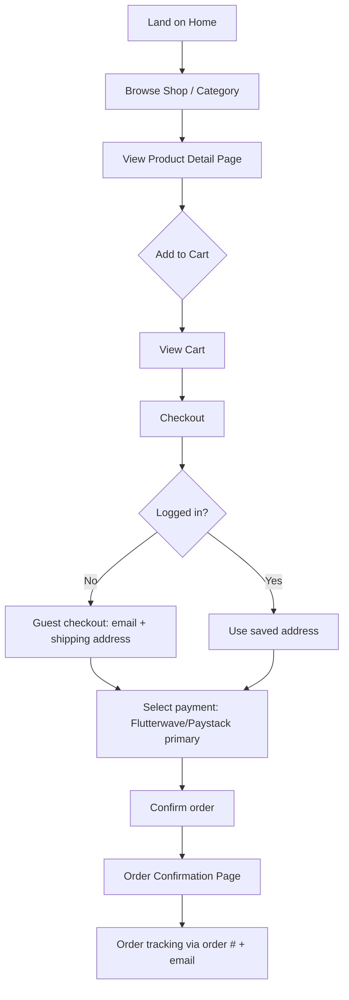
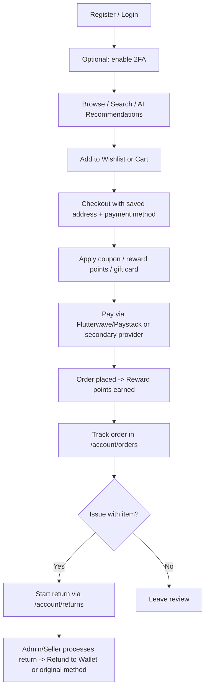
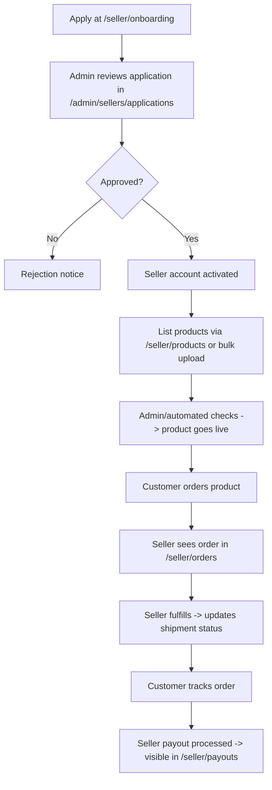
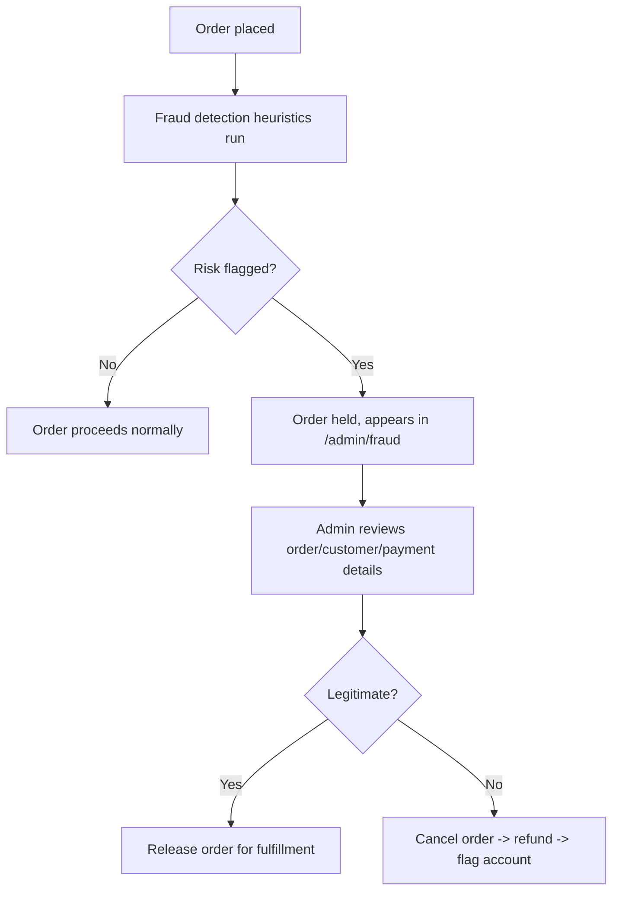
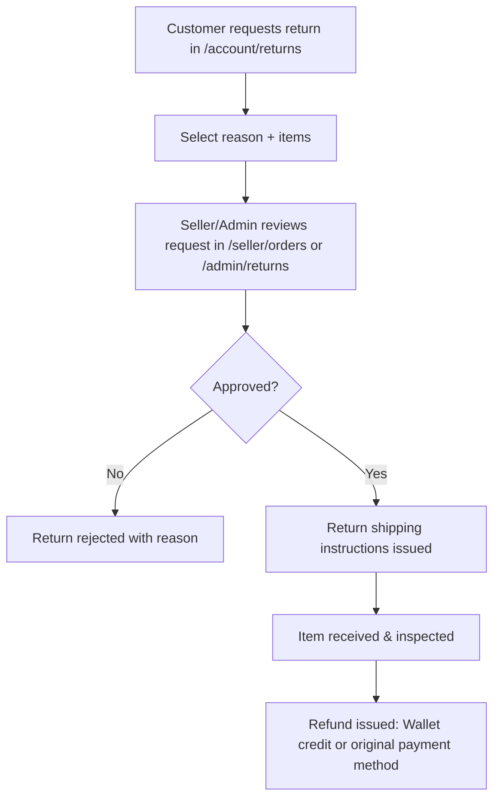

# ZYLIX — Sitemap & User Flows

**Version:** 1.0
**Status:** Draft for approval — Milestone 2 of 13
**Depends on:** [PRD.md](./PRD.md)

---

## 1. URL Structure Conventions

- Locale-agnostic v1 (English/NGN only), but routes are structured so a future `/{locale}/` prefix can be introduced without breaking changes (i18n routing lives at the Next.js App Router root).
- Slugs are lowercase, hyphenated: `/products/iphone-16-pro-max`
- Category paths are hierarchical: `/shop/smartphones/flagship`
- All customer-account, seller, and admin areas sit behind auth middleware and are excluded from the public sitemap.xml.

---

## 2. Full Sitemap

### 2.1 Public Storefront

```
/                                   Home
/shop                               All Products (catalog grid + filters)
/shop/[category]                    Category page (e.g. /shop/smartphones)
/shop/[category]/[subcategory]      Sub-category page
/products/[slug]                    Product Detail Page (PDP)
/search?q=                          Search Results Page
/compare                            Compare products (side-by-side, up to 4 items)
/wishlist                           Wishlist (guest = local storage, auth = synced)
/cart                               Cart
/checkout                           Checkout (guest + authenticated)
/checkout/payment                   Payment step
/checkout/confirmation/[orderId]    Order confirmation

/deals                              Deals / promotions landing
/new-arrivals                       New arrivals
/brands                             Brand directory
/brands/[brand]                     Brand storefront page

/blog                               Blog / editorial home
/blog/[slug]                        Blog article

/support                            Support Center home
/support/faq                       FAQ
/support/contact                   Contact page
/support/order-tracking            Order tracking (guest-accessible via order # + email)
/support/returns                   Returns & Refunds info + request start

/about                              About Zylix / Durchex D.A.M
/legal/privacy-policy
/legal/terms-of-service
/legal/shipping-policy
/legal/returns-policy
/legal/cookie-policy

/gift-cards                         Gift card purchase
/referral                           Referral program info + code
/newsletter/unsubscribe             Newsletter unsubscribe landing

/sitemap.xml
/robots.txt
```

### 2.2 Authentication

```
/auth/login
/auth/register
/auth/forgot-password
/auth/reset-password/[token]
/auth/verify-email/[token]
/auth/2fa/setup
/auth/2fa/verify
/auth/logout                        (action route)
```

### 2.3 Customer Dashboard (`/account`) — requires Customer role

```
/account                            Dashboard overview
/account/orders                     Order history
/account/orders/[orderId]           Order detail + tracking
/account/returns                    My return requests
/account/returns/[returnId]         Return request detail
/account/wishlist                   Saved items
/account/addresses                  Shipping/billing addresses
/account/payment-methods            Saved payment methods
/account/wallet                     Wallet balance & transaction history
/account/rewards                    Reward points balance & history
/account/coupons                    Available/saved coupons
/account/referrals                  Referral dashboard
/account/security                   Password, 2FA settings
/account/notifications              Notification preferences
/account/settings                   Profile, language/currency preference
```

### 2.4 Seller Dashboard (`/seller`) — requires Seller role
*(fully functional at launch; dormant until Durchex approves external sellers per PRD §10)*

```
/seller/onboarding                  Seller application/registration flow
/seller                             Seller dashboard overview (sales, orders snapshot)
/seller/products                    Product listings (table)
/seller/products/new                Create product
/seller/products/[id]/edit          Edit product
/seller/products/bulk-upload        Bulk CSV upload
/seller/orders                      Orders to fulfill
/seller/orders/[orderId]            Order detail / fulfillment actions
/seller/inventory                   Stock levels, low-stock alerts
/seller/payouts                     Earnings & payout history
/seller/analytics                   Seller-level sales analytics
/seller/reviews                     Reviews on seller's products
/seller/settings                    Store profile, payout details
```

### 2.5 Admin Dashboard (`/admin`) — requires Admin role (RBAC-scoped per §5 of PRD)

```
/admin                              Admin overview (KPIs, alerts)
/admin/catalog/products             Product management (all sellers)
/admin/catalog/products/[id]
/admin/catalog/categories           Category & taxonomy management
/admin/catalog/attributes           Spec/filter attribute management

/admin/orders                       All orders
/admin/orders/[orderId]
/admin/returns                      Returns & refund oversight

/admin/sellers                      Seller directory
/admin/sellers/applications         Pending seller approvals
/admin/sellers/[id]                 Seller detail / suspend / approve

/admin/users                        Customer/user management
/admin/users/[id]
/admin/roles                        Role & permission management (RBAC)

/admin/payments                     Payment provider configuration & transaction log
/admin/fraud                        Fraud detection queue / flagged orders

/admin/marketing/coupons            Coupon management
/admin/marketing/gift-cards         Gift card management
/admin/marketing/rewards            Reward program config
/admin/marketing/referrals          Referral program config
/admin/marketing/banners            Homepage/CMS banner management

/admin/cms/pages                    Static page editor (About, Legal, etc.)
/admin/cms/blog                     Blog post management

/admin/seo                          SEO tools (meta defaults, sitemap/robots control)
/admin/analytics                    Platform-wide analytics & reports
/admin/settings                     Platform settings (currency, tax, shipping zones)
/admin/audit-log                    Admin action audit trail
```

---

## 3. Key User Flows

### 3.1 Guest Browsing → Guest Checkout



### 3.2 Registered Customer Purchase (Full Loop)



### 3.3 Seller Onboarding & Fulfillment



### 3.4 Admin Fraud Review



### 3.5 Returns & Refunds Flow



---

## 4. Navigation Structure

### 4.1 Header (Storefront)
- Logo | Search bar (with AI/voice search icon) | Categories mega-menu | Deals | Wishlist icon | Cart icon | Account menu (Login/Register or Account dropdown)

### 4.2 Footer (all pages — required on every page)
- Columns: Shop (categories), Customer Service (Support/FAQ/Returns/Track Order), Company (About/Blog/Careers placeholder), Legal (Privacy/Terms/Shipping/Returns policies)
- Newsletter signup
- Payment method badges (Flutterwave, Paystack, Stripe, PayPal, Apple Pay, Google Pay)
- Social links
- **"Powered by Durchex D.A.M Company LTD"** — mandatory on every footer, every page, per brand requirement

### 4.3 Customer/Seller/Admin Dashboards
- Persistent left sidebar navigation scoped to role; top bar with search, notifications, profile menu.

---

## 5. Open Item for Approval

None blocking — this milestone is ready for review as-is. Flag if any page/route above should be added, removed, or restructured before Milestone 3.

---

**Approval required to proceed to Milestone 3: Database & Prisma Schema.**
